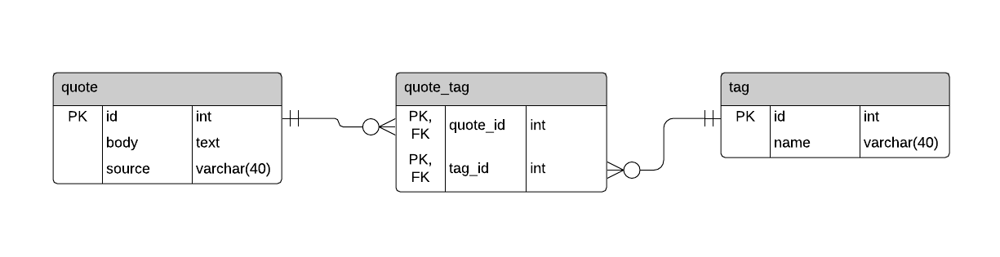

# quote-shufl
This is a simple Python3 project to mark my entry into the database world and to help familiarize myself with PostgreSQL 11 as a Relational Database Management System (RDBMS). At the basic level, this program pulls a random quote stored in a DB and displays it to the currently logged in user.

## Project Versions
- [x] **v1**: basic command-line application
- [x] **v2**: crude web app (with CRUD functionality) built with [Flask](https://flask.palletsprojects.com/en/1.1.x/) and [Materialize](https://materializecss.com/) frameworks
- [x] **v3**: improved web app (v2 but *better*):
  - CRUD operations via admin interface
  - complex queries simplified with views
  - ~ORM with SQLAlchemy~
- [ ] **v4**: to be continued...

## Running the Program
Before running either instances of the project, you will need to set up a PostgreSQL database with the relations described in the [Schema](#Schema) section. Sample data is provided in the `/data` directory of the repo, and can be loaded into the database by following the guide in the [psql](#Bulk-Loading-The-Data) section. In PostgreSQL, you will also need to create a user with the appropriate privileges in order to access the database. This is also covered in the [psql](#Creating-Users) section.

Once the database is set up and the data is loaded in, you will need to install all the required dependencies. Change directories into the version of the project that you wish to run.

Then, from a clean Python virtual environment, run the command:
```
pip3 install -r requirements.txt
```
### v1
Before you can run quote-shufl.py, you will need to set up the proper configuration file for the database. `v1` reads the DB configurations (host, user, password, ports, etc.) from a **.ini** file. Replace the information in `/v1/conf/db.ini` with the information that corresponds to the database and user information that you set up previously.

Once your configuration file is set up, you can launch the program from your virtual environment as you would any Python program:
```
python3 quote-shufl.py
```
If you would like to make the program a standalone executable, you will need to modify the shebang line at the top of the script with the absolute path to your virtual environment's python interpreter. You can find the path simply by running the following command (with your virtual environment activated):
```
which python3
```
To make the script executable, run the Linux command:
```
chmod +x quote-shufl.py
```
And now, you can run the script with `./`:
```
./quote-shufl.py
```
### v2
Before you can run app.py, you will need to configure a **.env** file. `v2` of the project loads DB configurations as environment variables from a .env file. A sample configuration can be found in `/v2/.env.example`. As shown in the example .env file, it sets the `FLASK_APP` and `FLASK_ENV` variables so you won't have to export them every time you run the application from a new terminal session (without this you would need to run `export FLASK_APP=app.py` and `export FLASK_ENV=DEBUG` in the Linux terminal before starting the app).

Once you have your .env file configured with the appropriate information for your database, run the following command in the terminal:
```
flask run
```
You should then be able to access the application through the browser at http://localhost:5000/.

### v3
Similar to v2, you will need to set up your **.env** with the appropriate information for your database. However, in order to be able to access the admin pages, which house endpoints for CRUD operations, you will need to create an admin user. In order to do this, you will need to create a table in the database to store the admin users. You can do this by running the following commands in psql:
```SQL
-- create a table to store admin users
CREATE TABLE users (
  id SERIAL PRIMARY KEY,
  username TEXT NOT NULL UNIQUE,
  password TEXT NOT NULL
);

-- import cryptographic module (need hash functions)
CREATE EXTENSION pgcrypto;

-- creates an admin user and stores the corresponding password as a hash 
INSERT INTO users (username, password) 
VALUES (
  'admin01',
  crypt('password', gen_salt('md5'))
);
```
> *Note*:  
You may adjust the *username* and *password* to any string that you wish, however the application is by no means secure, so you may not want to use any real or sensitive usernames/passwords.

Then, you will need to set up a VIEW in Postgres, which is accessed in the application (not in the original database design). 

```SQL
-- links the tables together for denormalized view
CREATE VIEW combined_tables AS
SELECT 
  q.id AS quote_id,
  q.body AS quote,
  q.source AS source,
  t.name AS tag,
  t.id AS tag_id
FROM quote q
INNER JOIN 
  quote_tag qt
ON 
  q.id = qt.quote_id
INNER JOIN
  tag t
ON
  qt.tag_id = t.id
;
```
After that, you may need to grant your user privileges on the `combined_tables` VIEW if user access is denied. This can be done by using the same SQL commands used in granting users privileges on [tables](#Permission-Denied).

Now, you should be able to run app.py with the command:
```
flask run
```

## Database Design
### Entity Relationship Diagram (ERD)


### Schema
```SQL
CREATE TABLE quote (
  id serial,
  body text,
  source varchar(40),
  PRIMARY KEY (id)
);

CREATE TABLE tag (
  id serial,
  name varchar(40) UNIQUE,
  PRIMARY KEY (id)
);

CREATE TABLE quote_tag (
  quote_id int,
  tag_id int,
  PRIMARY KEY (quote_id, tag_id),
  FOREIGN KEY(quote_id) REFERENCES quote(id),
  FOREIGN KEY (tag_id) REFERENCES tag(id)
);
```

## psql 
### Creating Users
You can create a user in psql with the `CREATE` command. For example:
```SQL
CREATE USER testuser WITH PASSWORD 'testpassword';
```
### Bulk-Loading the Data
The data set used in this project can be found in `/data` in the root of the project directory. Data can be loaded into a database in `psql` using the [`COPY`](https://www.postgresql.org/docs/11/sql-copy.html) command:
```SQL
COPY quote(body, source) FROM '/path/to/quote.csv' WITH (FORMAT CSV, HEADER TRUE);
```

## Common Issues
### Permission Denied
If you encounter a `permission denied for table` message, check that you have granted appropriate privileges to your database user. You can use the [`GRANT`](https://www.postgresql.org/docs/11/sql-grant.html) command to control access to databases, tables, and sequences.

To grant `ALL PRIVILEGES` to a user on the database and all tables, connect to the desired database in psql and run the following SQL commands:
```SQL
GRANT ALL PRIVILEGES ON DATABASE testdb TO testuser;
GRANT ALL PRIVILEGES ON ALL TABLES IN SCHEMA public TO testuser;
GRANT ALL PRIVILEGES ON ALL SEQUENCES IN SCHEMA public TO testuser;
```

For a least-privileges approach, adjust the commands above to look more like the following:
```SQL
GRANT CONNECT ON DATABASE testdb TO testuser;
GRANT SELECT, INSERT, UPDATE, DELETE ON ALL TABLES IN SCHEMA public TO testuser;
GRANT SELECT, USAGE ON ALL SEQUENCES IN SCHEMA public TO testuser;
```


